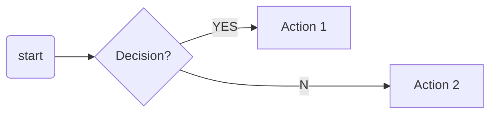

# Tutorial Template – Unified System

## How to Publish a New Tutorial

### 1. Create the content file

Place a `.md` or `.mdx` file inside `src/content/tutorials/` using the structure below.

**Use `.mdx`** if you need interactive components (Tabs, collapsible sections, etc.)

```markdown
---
title: "Tutorial Title"
description: "Concise summary of the tutorial"
category: "Setup"
section: "Jetson Setup"
order: 1
tags: ["tag1", "tag2", "tag3"]
---

## Overview

Tutorial introduction...

## Prerequisites

- **JetPack 6.x**
- **Jetson Orin Nano / AGX Orin**

## Step 1: Setup

Instructions here...

## Next Steps

Links to related tutorials...
```

**Accepted values for `category`:** `Setup`, `Text`, `Image`, `Audio`, `Multimodal`, `Fundamentals`, `Workshops`

---

### 2. Create the Astro page

Add a minimal `.astro` file under `src/pages/tutorials/`:

```astro
---
import TutorialLayout from '../../layouts/TutorialLayout.astro';
---

<TutorialLayout tutorialId="your-tutorial-filename" />
```

---

## Reusable Components (for MDX files)

For tutorials with interactive elements, use `.mdx` files.

### Import the Tabs Component

```mdx
---
title: "My Tutorial"
description: "Tutorial with tabs"
category: "Setup"
...
---

import Tabs from '../../components/Tabs.astro';

Content here...
```

### Main Tabs

Use for switching between major content sections:

```mdx
<Tabs labels={["🖥️ Method A", "📡 Method B", "😁 Method C"]}>
<div class="nv-tab-panel active">

Content for Method A (first tab is active by default)

</div>

<div class="nv-tab-panel">

Content for Method B

</div>

<div class="nv-tab-panel">

Content for Method C

</div>
</Tabs>
```

### Subtabs (GUI/CUI)

Use for nested tabs within content:

```html
<div class="nv-subtabs">
  <div class="nv-subtabs-labels">
    <button type="button" class="nv-subtab-btn active">🖥️ GUI</button>
    <button type="button" class="nv-subtab-btn">>_ CUI</button>
  </div>
  <div class="nv-subtabs-content">
    <div class="nv-subtab-panel active">
      GUI content here
    </div>
    <div class="nv-subtab-panel">
      Command line content here
    </div>
  </div>
</div>
```

### Admonitions (Note, Warning, Tip, Danger, Info)

```html
<div class="admonition note">
<p class="admonition-title">📘 Note</p>
<p>This is a note with helpful information.</p>
</div>

<div class="admonition warning">
<p class="admonition-title">⚠️ Warning</p>
<p>This is a warning about something important.</p>
</div>

<div class="admonition tip">
<p class="admonition-title">✅ Tip</p>
<p>This is a helpful tip.</p>
</div>

<div class="admonition danger">
<p class="admonition-title">🚫 Danger</p>
<p>This is a critical warning.</p>
</div>

<div class="admonition info">
<p class="admonition-title">ℹ️ Info</p>
<p>This is general information.</p>
</div>
```

### Collapsible/Expandable Sections

```html
<details class="nv-details">
<summary>Click to expand</summary>
<div class="nv-details-content">

Hidden content revealed when expanded.

</div>
</details>
```

### Buttons

```html
<!-- Primary button (NVIDIA green) -->
<a href="/link" class="nv-button">Download Now</a>

<!-- Secondary button (purple) -->
<a href="/link" class="nv-button secondary">Alternative Option →</a>
```

### Images

```html

```

### Keyboard Keys

```html
Press <kbd>Esc</kbd> to continue.
```

### Color-coded Labels

```html
<span class="blob-green">Green</span>
<span class="blob-white">White</span>
<span class="blob-black">Black</span>
```

### Mermaid Diagrams

Use standard markdown code blocks with `mermaid` language:

~~~markdown

~~~

### Code Blocks in JSX (for MDX)

When using code inside JSX elements, escape with curly braces:

```html
<pre style="background: #1e293b; color: #e2e8f0; padding: 1rem; border-radius: 8px;">
  <code>{"sudo apt-get install package-name"}</code>
</pre>
```

For multi-line code, use `\n` for newlines:

```html
<pre style="background: #1e293b; color: #e2e8f0; padding: 1rem; border-radius: 8px; white-space: pre-wrap;">
  <code>{"line 1\nline 2\nline 3"}</code>
</pre>
```

---

## File Structure

```
src/
├── components/
│   └── Tabs.astro              # Tabs + global styles
├── layouts/
│   └── TutorialLayout.astro    # Unified layout
├── content/
│   └── tutorials/
│       ├── tutorial-1.md       # Simple markdown
│       ├── tutorial-2.mdx      # MDX with components
│       └── ...
└── pages/
    └── tutorials/
        ├── tutorial-1.astro    # Minimal page wrapper
        ├── tutorial-2.astro
        └── index.astro         # Tutorial directory
```

---

## Complete MDX Example

```mdx
---
title: "Complete Example Tutorial"
description: "Shows all available components"
category: "Setup"
section: "Getting Started"
order: 1
tags: ["example", "demo"]
---

import Tabs from '../../components/Tabs.astro';

<div class="admonition note">
<p class="admonition-title">📘 Note</p>
<p>This tutorial demonstrates all available components.</p>
</div>

## Choose Your Method

<Tabs labels={["🐧 Ubuntu", "🪟 Windows"]}>
<div class="nv-tab-panel active">

Ubuntu instructions here...

```bash
sudo apt update
```

</div>

<div class="nv-tab-panel">

Windows instructions here...

```powershell
winget install package
```

</div>
</Tabs>

## Learn More

<details class="nv-details">
<summary>Advanced Configuration</summary>
<div class="nv-details-content">

Additional details hidden by default...

</div>
</details>

## Next Steps

<p>
<a href="/tutorials/next" class="nv-button">Continue →</a>
</p>
```

---

## Benefits of the Unified System

- ✅ Professional design with NVIDIA branding
- ✅ Consistent styling across all tutorials
- ✅ Interactive tabs and collapsible sections
- ✅ Mermaid diagram support
- ✅ Responsive layout for all devices
- ✅ SEO-ready metadata
- ✅ Easy to maintain and extend

