import Tabs from '../../components/Tabs.astro';


<div class="admonition note">
<p class="admonition-title">📘 Note</p>
<p>This guide is to supplement the official <a href="https://developer.nvidia.com/embedded/learn/get-started-jetson-orin-nano-devkit"><strong>Jetson Orin Nano Developer Kit Getting Started Guide</strong></a>.</p>
</div>

The NVIDIA® <span class="blobLightGreen4">Jetson Orin Nano™ Developer Kit</span> is a perfect kit to start your journey of local generative AI evaluation and development.

This guide explains the **alternative method** for setting up Jetson Orin Nano Developer Kit by flashing both the latest firmware (QSPI image) and the latest JetPack all at once, using a host x86 PC.

---

## Check your toolbox

The following items are needed or highly desired for flashing your Jetson Orin Nano Developer Kit using your host PC.

If you don't have them, check the [default microSD-only setup instruction](/tutorials/initial-setup-jetson-orin-nano) or arrange them first then return to this guide once they are available.

<div class="admonition warning">
<p class="admonition-title">⚠️ What does NOT come in the box - What you need/want to prepare</p>

### Host PC

- ☐ x86 PC running **Ubuntu 22.04** or **Ubuntu 20.04**


### Storage

Either of the following:

- ☐ microSD card (64GB or bigger)
- ☐ NVMe SSD (Recommended for better performance)

<p>


</p>

### Flashing supply

- ☐ USB cable (USB-C plug for Jetson Orin Nano Developer Kit side, other end depends on your PC)
- ☐ Jumper pin (or metal paper clip)

### Means to access terminal

You need either of the following sets:

- ☐ DisplayPort cable, DisplayPort capable monitor and a USB keyboard
- ☐ DisplayPort to HDMI cable and HDMI capable monitor (or TV) and a USB keyboard
- ☐ [USB to TTL Serial cable](https://www.adafruit.com/product/954) (Advanced)

</div>

<div class="admonition danger">
<p class="admonition-title">🚀 Default method: microSD card only setup method</p>

In case you **do NOT** have an x86 PC running Ubuntu 22.04 or 20.04, you can fall back to the default "microSD card only" setup method that does not require any host PC.

The decision process can look like this:

```mermaid
flowchart LR
    A(start) --> B{Want to ditch microSD<br>and only use NVMe SSD?}
    B --YES--> S[SDK Manager method]
    B --No--> C{Have x86 PC running<br> Ubuntu 22.04/20.04?}
    C --YES--> S
    C --No--> U[🚀 microSD-only method]

    style S stroke-width:3px, fill:#f3e9f2,stroke:#b544c4
    style U stroke-width:3px, fill:#d2e9e5,stroke:#0e7a71
```



Click the button below to jump to the default setup page.

<p><a href="/tutorials/initial-setup-jetson-orin-nano" class="nv-button" style="background: #0e7a71; color: white;">🚀 microSD-only method</a></p>

Otherwise, continue reading on this page for the SDK Manager method.

</div>

---

## Overall flow (SDK Manager method)

```mermaid
flowchart
    A(start) --> B[0️⃣ Install SDK Manager]
    B --> C[1️⃣ Connect Target Hardware] 
    C --> D[2️⃣ Select Software Components to Install]
    D --> E[3️⃣ Download on Host PC]
    E --> F[4️⃣ Flash]
    F --> G[5️⃣ Boot and initial setup]
    G --> P(👍 Start developing on JetPack 6.2)
```

<div class="admonition info">
<p class="admonition-title">ℹ️ Jetson Orin Nano Initial Setup Flowchart (SDK Manager method)</p>



</div>

---

## 0️⃣ Install SDK Manager

<div class="admonition info">
<p class="admonition-title">ℹ️ Reference</p>
<p>🔗 <a href="https://docs.nvidia.com/sdk-manager/" target="_blank">NVIDIA SDK Manager Documentation</a><br/>
→ <strong>Download and Install</strong> → <a href="https://docs.nvidia.com/sdk-manager/download-run-sdkm/index.html" target="_blank">Download and Run SDK Manager</a></p>
</div>

On your Ubuntu 22.04 / 20.04 PC, open a terminal and execute the following command.

Select the tab that matches your Ubuntu version.

<Tabs labels={["🐧 Ubuntu 22.04", "🐧 Ubuntu 20.04"]}>
<div class="nv-tab-panel active">

```bash
wget https://developer.download.nvidia.com/compute/cuda/repos/ubuntu2204/x86_64/cuda-keyring_1.1-1_all.deb
sudo dpkg -i cuda-keyring_1.1-1_all.deb
sudo apt-get update
sudo apt-get -y install sdkmanager
```

</div>

<div class="nv-tab-panel">

```bash
wget https://developer.download.nvidia.com/compute/cuda/repos/ubuntu2004/x86_64/cuda-keyring_1.1-1_all.deb
sudo dpkg -i cuda-keyring_1.1-1_all.deb
sudo apt-get update
sudo apt-get -y install sdkmanager
```

</div>
</Tabs>

Then launch SDK Manager with the following command:

```bash
sdkmanager
```

<details class="nv-details">
<summary>First time using SDK Manager</summary>
<div class="nv-details-content">

When using SDK Manager for the first time, log in with your NVIDIA Developer credentials.

Remember to tick the checkbox for "**Stay logged in**" and click "**LOGIN**" button.


A browser window opens. Input your email address that is registered as NVIDIA Developer.


Two factor authentication prompt may pop up.


Once authenticated, the browser window redirects back to SDK Manager.


SDK Manager continues to log you in.


</div>
</details>

SDK Manager launched and the login completed.


---

## 1️⃣ Connect the Target Hardware

Once SDK Manager is launched, connect your Jetson developer kit to your Ubuntu PC and power it on in Forced Recovery mode.

1. **Connect** your Jetson Orin Nano Developer Kit to your PC with a USB cable.
   
   > Note: The USB cable goes into the USB-C port of the carrier board of the developer kit.

2. While shorting `pin 9` and `pin 10` of `J14` header located below the Jetson module using a jumper pin, insert the DC power supply plug into the DC jack of the carrier board to power it on.

   
   
   You can use a paper clip like the photo below as well.
   
   

3. Select "**Jetson Orin Nano [8GB developer kit version]**" and hit "**OK**"

   

4. Uncheck "**Host Machine**" - it should now look like this:

   

5. Click "**Continue**" button to proceed to the next step.

---

## 2️⃣ Select Software Components to Install

1. Leave only "**Jetson Linux**" component checked, and uncheck everything else.

   

2. Remember to check "**I accept the terms and conditions of the license agreements**".

3. Click "**Continue**" button to proceed.

4. It will prompt for the `sudo` command password.

   

---

## 3️⃣ Download on Host PC

1. It will start downloading the "BSP" package and "RootFS" package.

   

2. Once downloads are complete, it will untar the package and start generating the images to flash in the background.

   

3. Once images are ready, SDK Manager will open the prompt for flashing.

   

---

## 4️⃣ Flash

1. On the flashing prompt, select "**Runtime**" for "OEM Configuration".

   

2. Select "**NVMe**" if you want to flash Jetson Linux (BSP) to NVMe SSD (or "**SD Card**" for microSD).

   

3. Click "**Flash**" and the prompt popup will change.

   

4. Flash progress:

<Tabs labels={["📋 Details", "💻 Terminals"]}>
<div class="nv-tab-panel active">


</div>

<div class="nv-tab-panel">


</div>
</Tabs>

5. Flash successfully completes:

<Tabs labels={["📋 Details", "💻 Terminals"]}>
<div class="nv-tab-panel active">


</div>

<div class="nv-tab-panel">


</div>
</Tabs>

---

## 5️⃣ Boot and Initial Setup

1. If still plugged, **remove the jumper** from header (that was used to put it in Forced Recovery mode)

2. **Connect peripherals:** DisplayPort cable/adapter and USB keyboard/mouse to Jetson Orin Nano Developer Kit, or hook up the USB to TTL Serial cable.

3. **Power cycle:** Unplug the power supply and put back in.

4. Jetson should now boot into the Jetson Linux (BSP) of your selected JetPack version from the storage of your choice.

5. **Complete the initial software setup** (`oem-config`)

---

## Switch to MAXN SUPER mode

Note that the default power mode on JetPack 6.2 on Jetson Orin Nano Developer Kit is **25W**.

To switch to the **MAXN SUPER** mode and unlock the unregulated performance:

1. Click on the current power mode (**25W**) by clicking the NVIDIA icon on the right side of the Ubuntu desktop's top bar.
2. Select **Power mode** from the menu.
3. Choose **MAXN SUPER** to enable maximum performance.


---

## 🎊 Congratulations!

Your Jetson Orin Nano Developer Kit is set up with JetPack 6.2 image and you are ready to develop!

---

## Next Steps

- [SSD + Docker Setup](/tutorials/ssd-docker-setup) - Install NVMe SSD and configure Docker
- [microSD-only method](/tutorials/initial-setup-jetson-orin-nano) - Alternative setup without host PC

